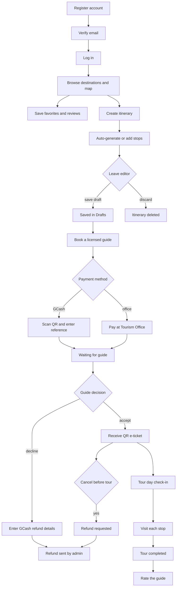
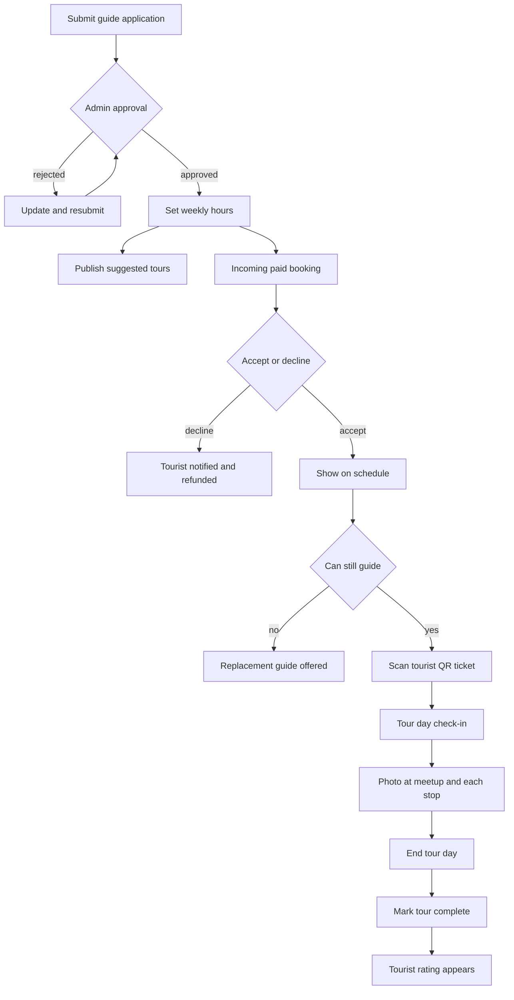
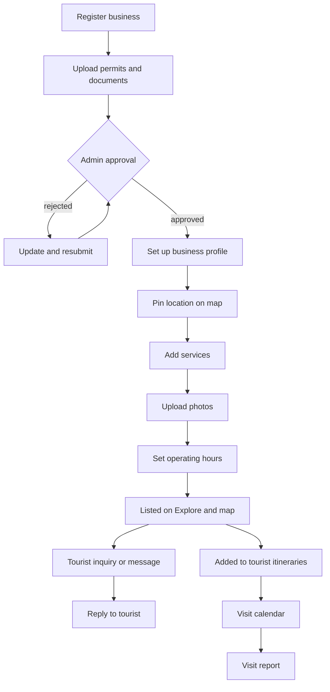
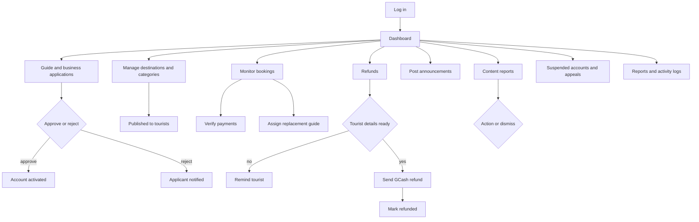

# CulTour Design Model

## Tourist

```mermaid
flowchart TD
  reg[Register account] --> verify[Verify email]
  verify --> login[Log in]
  login --> browse[Browse destinations and map]
  browse --> fav[Save favorites and reviews]
  browse --> plan[Create itinerary]
  plan --> auto[Auto-generate or add stops]
  auto --> leave{Leave editor}
  leave -->|save draft| draft[Saved in Drafts]
  leave -->|discard| discard[Itinerary deleted]
  draft --> book[Book a licensed guide]
  book --> pay{Payment method}
  pay -->|GCash| gcash[Scan QR and enter reference]
  pay -->|office| office[Pay at Tourism Office]
  gcash --> wait[Waiting for guide]
  office --> wait
  wait --> decide{Guide decision}
  decide -->|decline| refundAsk[Enter GCash refund details]
  refundAsk --> refundSent[Refund sent by admin]
  decide -->|accept| ticket[Receive QR e-ticket]
  ticket --> tourDay[Tour day check-in]
  tourDay --> stops[Visit each stop]
  stops --> done[Tour completed]
  done --> rate[Rate the guide]
  ticket --> cancel{Cancel before tour}
  cancel -->|yes| refundReq[Refund requested]
  refundReq --> refundSent
```

## Tour Guide

```mermaid
flowchart TD
  apply[Submit guide application] --> review{Admin approval}
  review -->|rejected| resubmit[Update and resubmit]
  resubmit --> review
  review -->|approved| hours[Set weekly hours]
  hours --> suggested[Publish suggested tours]
  hours --> incoming[Incoming paid booking]
  incoming --> decide{Accept or decline}
  decide -->|decline| declined[Tourist notified and refunded]
  decide -->|accept| schedule[Show on schedule]
  schedule --> withdraw{Can still guide}
  withdraw -->|no| replace[Replacement guide offered]
  withdraw -->|yes| scan[Scan tourist QR ticket]
  scan --> checkin[Tour day check-in]
  checkin --> photo[Photo at meetup and each stop]
  photo --> endDay[End tour day]
  endDay --> complete[Mark tour complete]
  complete --> rating[Tourist rating appears]
```

## Business

```mermaid
flowchart TD
  reg[Register business] --> docs[Upload permits and documents]
  docs --> review{Admin approval}
  review -->|rejected| resubmit[Update and resubmit]
  resubmit --> review
  review -->|approved| profile[Set up business profile]
  profile --> location[Pin location on map]
  location --> services[Add services]
  services --> photos[Upload photos]
  photos --> hours[Set operating hours]
  hours --> listed[Listed on Explore and map]
  listed --> inquiry[Tourist inquiry or message]
  inquiry --> reply[Reply to tourist]
  listed --> planned[Added to tourist itineraries]
  planned --> calendar[Visit calendar]
  calendar --> report[Visit report]
```

## Admin

```mermaid
flowchart TD
  login[Log in] --> dash[Dashboard]
  dash --> apps[Guide and business applications]
  apps --> approve{Approve or reject}
  approve -->|approve| active[Account activated]
  approve -->|reject| notified[Applicant notified]
  dash --> content[Manage destinations and categories]
  content --> publish[Published to tourists]
  dash --> bookings[Monitor bookings]
  bookings --> verify[Verify payments]
  bookings --> replaceGuide[Assign replacement guide]
  dash --> refunds[Refunds]
  refunds --> details{Tourist details ready}
  details -->|no| remind[Remind tourist]
  details -->|yes| send[Send GCash refund]
  send --> marked[Mark refunded]
  dash --> announce[Post announcements]
  dash --> reports[Content reports]
  reports --> action{Action or dismiss}
  dash --> suspend[Suspended accounts and appeals]
  dash --> logs[Reports and activity logs]
```
